<h1> Stress Testing </h1>

<h2> Initial data </h2>

- The database is filled with test data. 1_000_000 profiles loaded
- The endpoint `/user/search?first_name=&second_name=` is being tested

<h2> Test Scenario </h2>

- Testing with JMeter
- We register the user and receive a token for him in advance
- We make requests to the handle `/user/search?first_name=&second_name=`, as parameters `first_name` and `second_name` we pass two random letters from the list `ABVGDEJZYKLMNOPRSTUSHFEYCH`
- We do several tests with different numbers of simultaneous requests
- The duration of each test is 1 minute
- The test plan is in the folder `sn-data-loader/jmeter`

<h2> Results before optimization </h2>

- Query for searching profiles by first and last name prefix (simultaneously)
```sql
SELECT * 
FROM users 
WHERE first_name ILIKE ':firstName%' AND second_name ILIKE ':secondName%'
ORDER BY user_id;
```
- Query plan without index
<p>
  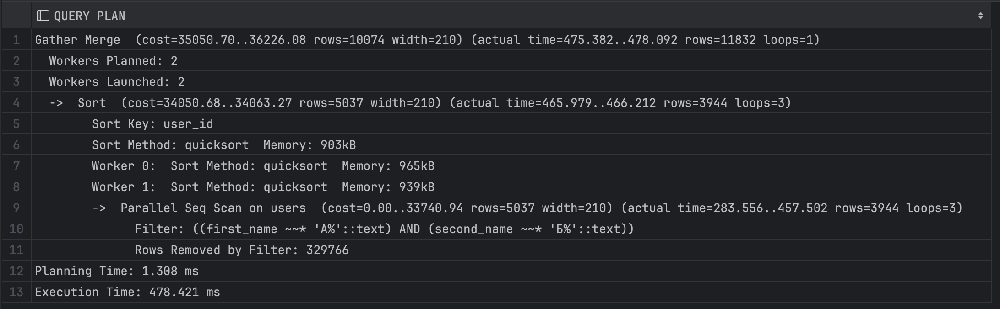
</p>

<h3 align="center"> 10 rps </h3>

<p align="center">
  <b>Latency</b><br>
  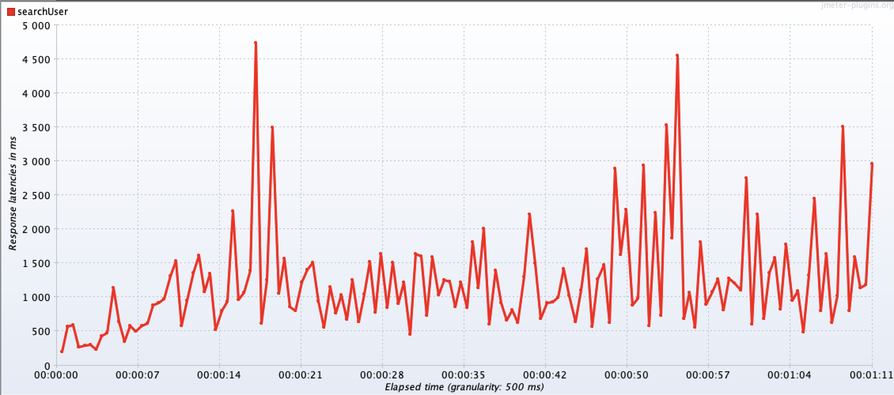
</p>
<p align="center">
  <b>Throughput</b><br>
  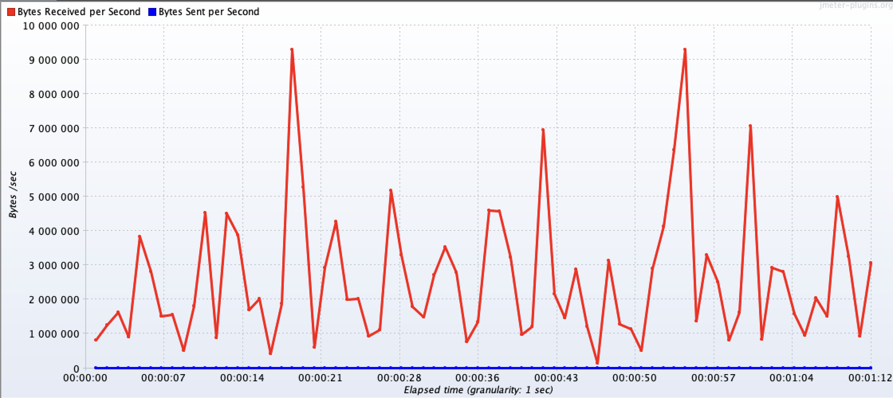
</p>

<h3 align="center"> 25 rps </h3>

<p align="center">
  <b>Latency</b><br>
  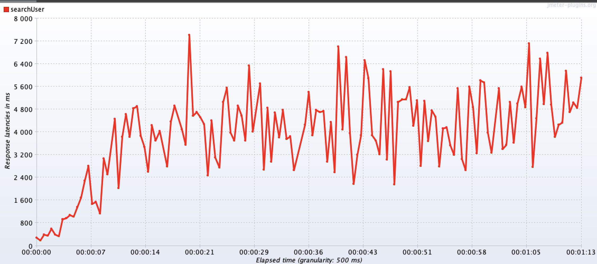
</p>
<p align="center">
  <b>Throughput</b><br>
  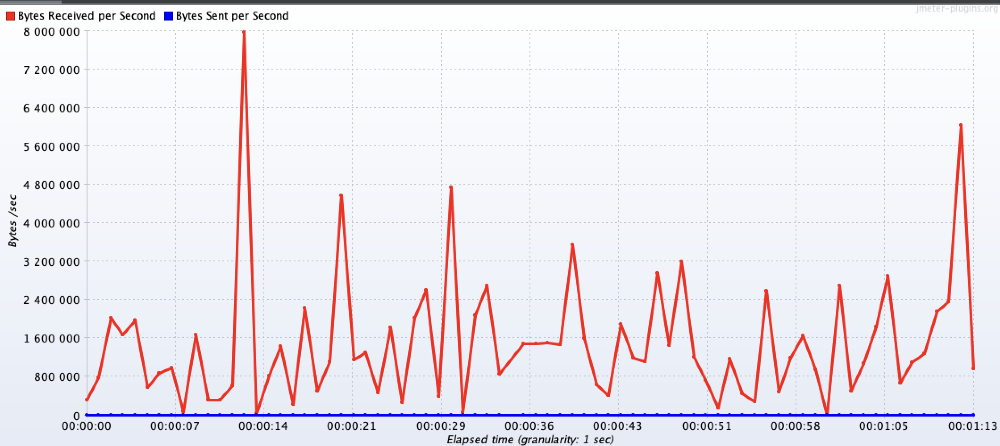
</p>

<h3 align="center"> 50 rps </h3>

<p align="center">
  <b>Latency</b><br>
  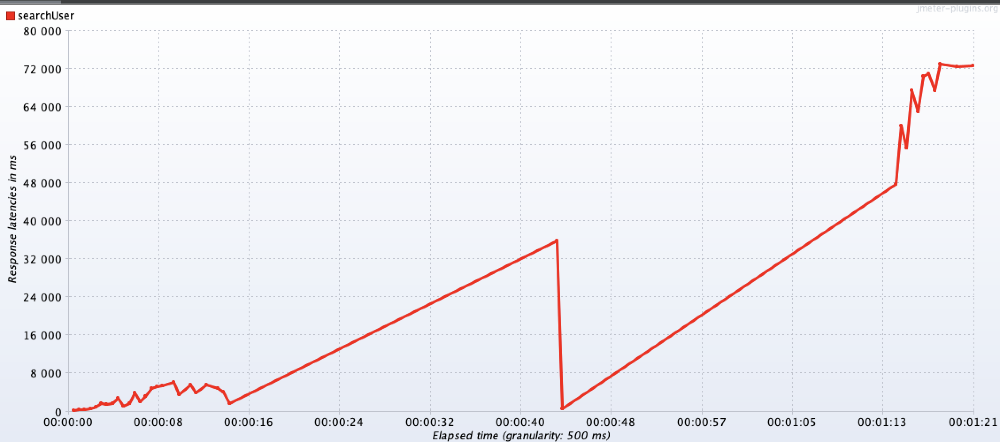
</p>
<p align="center">
  <b>Throughput</b><br>
  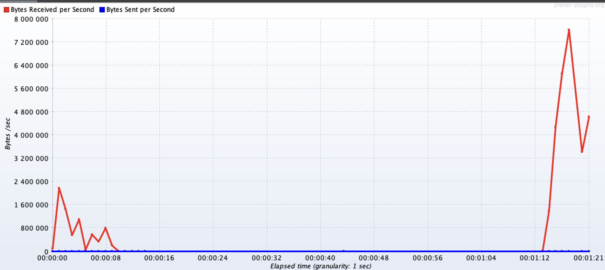
</p>

<h2> Possible optimizations </h2>
To speed up the endpoint, it is suggested to do several things

1. We need an index on the first_name and second_name fields. Since searching by prefix, the GIN index will work, we add a composite index to both of these fields.
2. Since there is no limit in the query, it is worth thinking about an index to speed up sorting by user_id, since there is a lot of data to be selected. The index will be B-Tree since it works well when sorting. To substantiate this index, testing was carried out with and without it at 50 rps

<h2> Results after optimization </h2>

- Request to build an index
```sql
CREATE INDEX IF NOT EXISTS idx_first_name_second_name ON users (first_name, second_name);
CREATE INDEX IF NOT EXISTS idx_user_id ON users (user_id);
```

- Query plan with indexes
<p>
  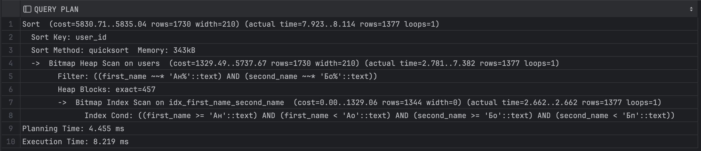
</p>

<h3 align="center"> 10 rps </h3>

<p align="center">
  <b>Latency</b><br>
  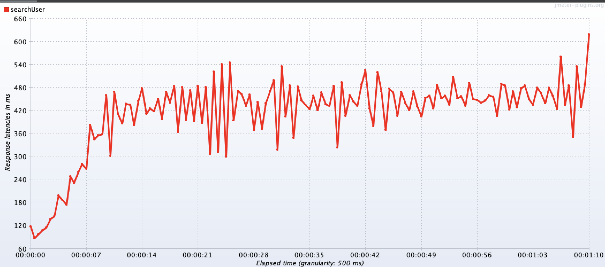
</p>
<p align="center">
  <b>Throughput</b><br>
  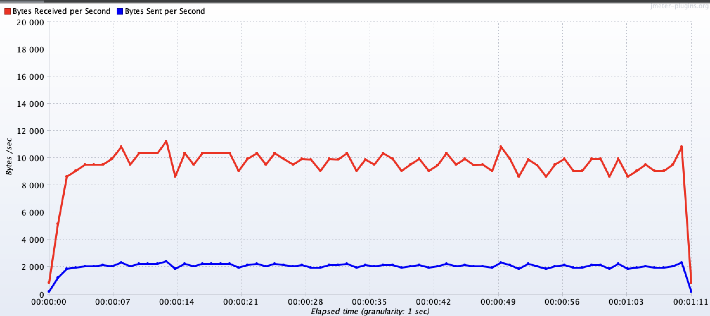
</p>

<h3 align="center"> 50 rps with idx_user_id </h3>

<p align="center">
  <b>Latency</b><br>
  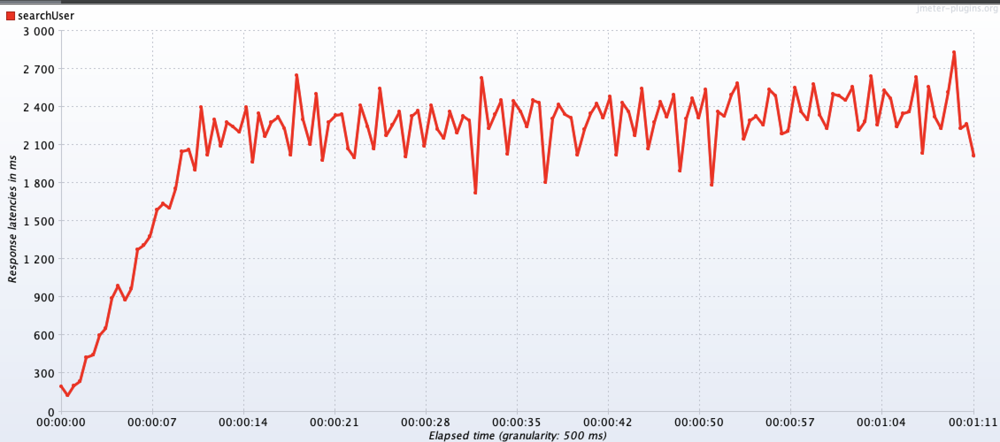
</p>
<p align="center">
  <b>Throughput</b><br>
  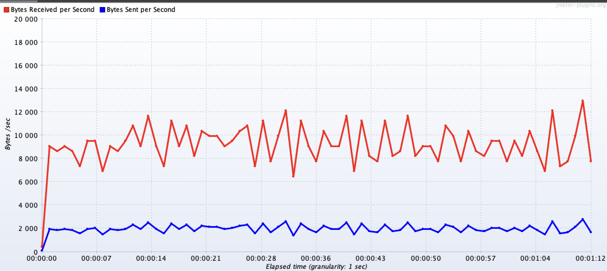
</p>

<h3 align="center"> 50 rps without idx_user_id </h3>

<p align="center">
  <b>Latency</b><br>
  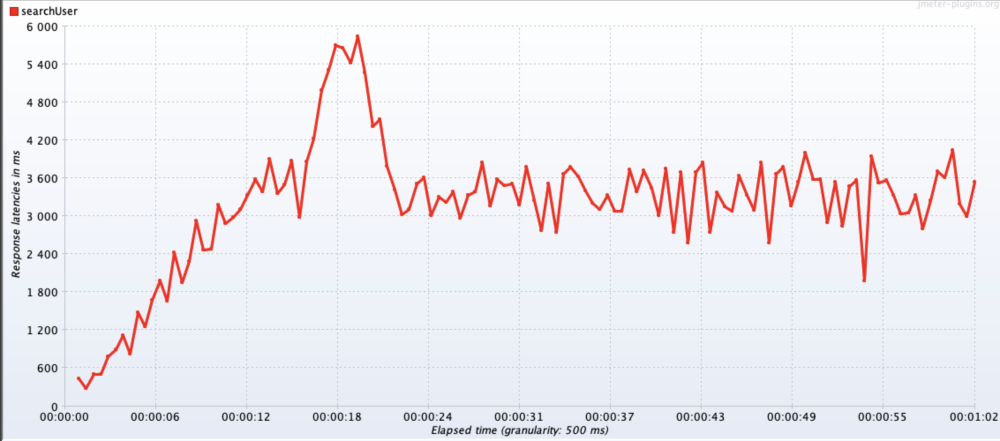
</p>
<p align="center">
  <b>Throughput</b><br>
  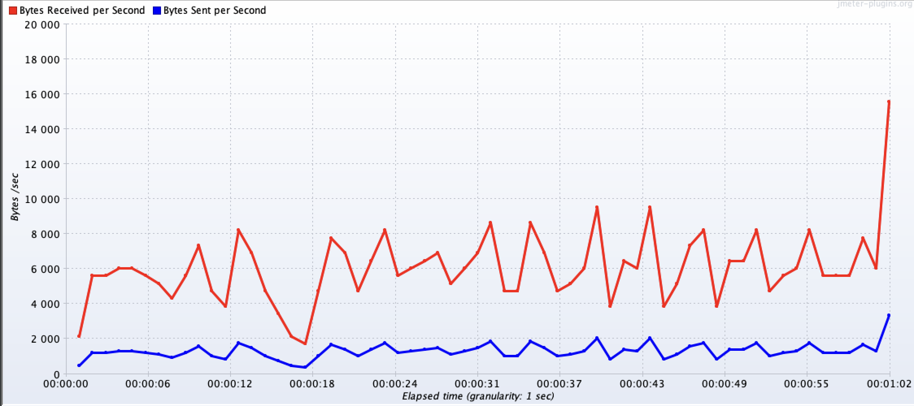
</p>

<h3 align="center"> 100 rps </h3>

<p align="center">
  <b>Latency</b><br>
  
</p>
<p align="center">
  <b>Throughput</b><br>
  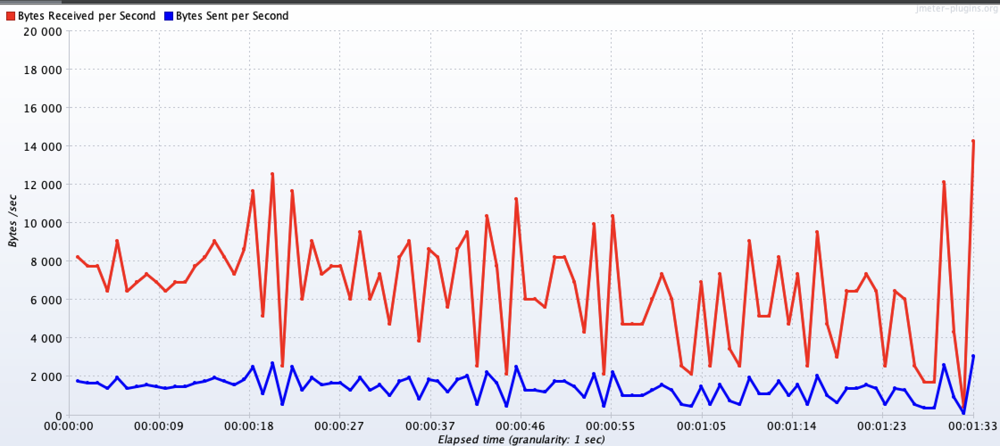
</p>

<h2> Conclusions </h2>

**The proposed optimizations will allow:**

- improve request latency at different rps
- hold a large load, before adding indexes the application crashed at 50 rps, now it is capable of handling 100 rps (though with inadequate latency)