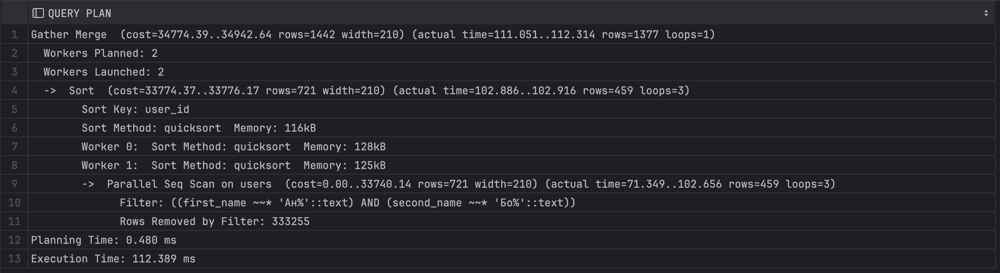

<h1> Нагрузочное тестирование </h1>

<h2> Исходные данные </h2>

- База данных заполнена тестовыми данными. Загружено 1_000_000 анкет
- Тестируется ручка `/user/search?first_name=&second_name=`

<h2> Сценарий </h2>

- Тестируем с помощью JMeter
- Регистрируем пользователя и получаем токен для него заранее
- Делаем запросы в ручку `/user/search?first_name=&second_name=`, в качестве параметров `first_name` и `second_name` передаем одну рандомную букву из списка `АБВГДЕЖЗИКЛМНОПРСТУШХФЭЯЧ`
- Делаем 3 теста с различным количеством одновременных запросов: 1/10/100.
- Длительность каждого теста 1 минута
- Тест план лежит в папке `sn-data-loader/jmeter`

<h2> Результаты до оптимизации </h2>

- Запрос для поиска анкет по префиксу имени и фамилии (одновременно)
```sql
SELECT * 
FROM users 
WHERE first_name ILIKE ':firstName%' AND second_name ILIKE ':secondName%'
ORDER BY user_id;
```
- План запроса без индекса
<p>
  
</p>

<h3 align="center"> 1 rps </h3>

<p align="center">
  <b>Latency</b><br>
  
</p>
<p align="center">
  <b>Throughput</b><br>
  
</p>

<h3 align="center"> 10 rps </h3>

<p align="center">
  <b>Latency</b><br>
  
</p>
<p align="center">
  <b>Throughput</b><br>
  
</p>

<h3 align="center"> 100 rps </h3>

<p align="center">
  <b>Latency</b><br>
  
</p>
<p align="center">
  <b>Throughput</b><br>
  
</p>